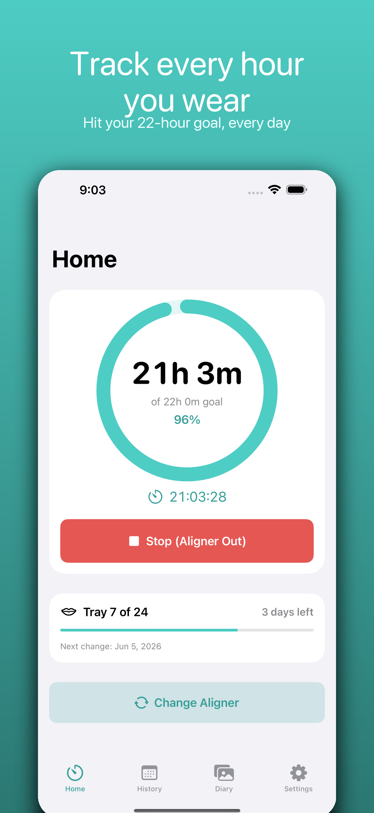
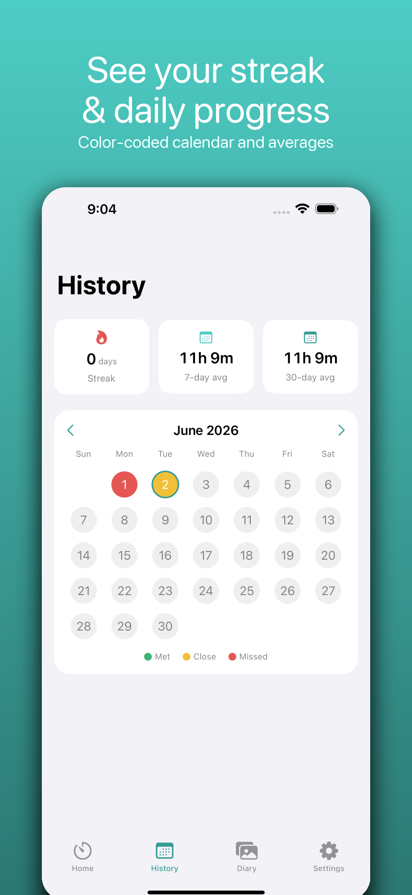
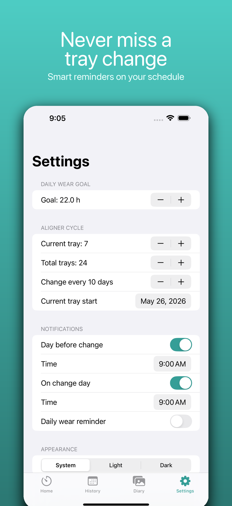

# Aligner Tracker 🦷

A clean, fully-offline iOS app for clear-aligner (and retainer) wearers to track
daily wear time, manage tray-change cycles, and keep a photo diary of their smile
journey. Built with SwiftUI, SwiftData, and WidgetKit. English and 简体中文.

<p align="center">
  
  
  
</p>

## Features

- **Wear-time timer** — one tap to start/pause, a live session clock and today's
  total, and a circular progress ring toward your daily goal (default **22h**).
  State survives app termination and correctly splits time across midnight.
- **Daily log & streaks** — a color-coded calendar (green = goal met, yellow =
  close, red = missed), weekly/monthly averages, and a consecutive-day streak.
- **Aligner change cycle** — set current tray, total trays, and interval; see
  days remaining and a countdown; local reminders **the day before** and **on
  change day**, each at its own adjustable time.
- **Photo diary** — snap a smile photo on every tray change, auto-stamped with
  date, tray number, and treatment day; timeline gallery, full-screen detail,
  and PDF export.
- **Widgets** — Home Screen (small/medium) and Lock Screen (inline/circular/
  rectangular) widgets show wear time, tray number, and days until next change.
- **Private by design** — 100% offline, no account, no tracking; export all data
  as JSON anytime.
- **Bilingual** — full English and Simplified Chinese localization.

## Tech stack

- **Swift / SwiftUI**, MVVM with `@Observable`
- **SwiftData** for logs and diary entries
- **WidgetKit** + **App Groups** for the shared store between app and widget
- **UserNotifications** for local reminders, **PhotosUI / AVFoundation** for photos
- **String Catalog** (`Localizable.xcstrings`) for en + zh-Hans
- Minimum **iOS 17.0**

## Project structure

```
Aligner Tracker/            App target
├── Models/                 WearSession, DailyLog, AlignerDiaryEntry, AppSettings
├── ViewModels/             TimerViewModel, DiaryViewModel, SettingsViewModel
├── Views/                  Home, History, Diary, DiaryEntry, ChangeAligner, Settings, Onboarding
├── Services/               SharedStore, NotificationService, BackupService
├── Support/                Theme, ProgressRing, SystemPickers
├── Localizable.xcstrings   en + zh-Hans
└── PrivacyInfo.xcprivacy
AlignerTrackerWidget/       Widget extension (small / medium / lock-screen)
Shared/                     Code compiled into both targets (WearMath)
AlignerTrackerTests/        Unit tests (Swift Testing)
AppStore/                   Publishing assets (see below)
```

## Build & run

Requires Xcode 16+ (project format objectVersion 77) and iOS 17+.

```bash
open "Aligner Tracker.xcodeproj"   # then run the "Aligner Tracker" scheme
```

Or from the command line:

```bash
xcodebuild -project "Aligner Tracker.xcodeproj" -scheme "Aligner Tracker" \
  -destination 'platform=iOS Simulator,name=iPhone 16 Pro Max' build
```

### App Group

The app and widget share data through the App Group `group.ACM.Aligner-Tracker`.
To run on a physical device, enable the **App Groups** capability for both targets
under your team and create that group (see `AppStore/PUBLISHING.md`).

## Publishing

Everything needed for the App Store lives in [`AppStore/`](AppStore):

- `PUBLISHING.md` — step-by-step submission guide
- `APP_STORE_CONNECT_FIELDS.md` — copy-paste product-page content (EN + 中文)
- `PRIVACY_POLICY.md` and `APP_PRIVACY_ANSWERS.md`
- `ExportOptions.plist` for `xcodebuild -exportArchive`
- `screenshots/6.9-inch/` and `screenshots/6.5-inch/` — framed App Store images

## License

© 2026 Feiyu Chang. All rights reserved.
